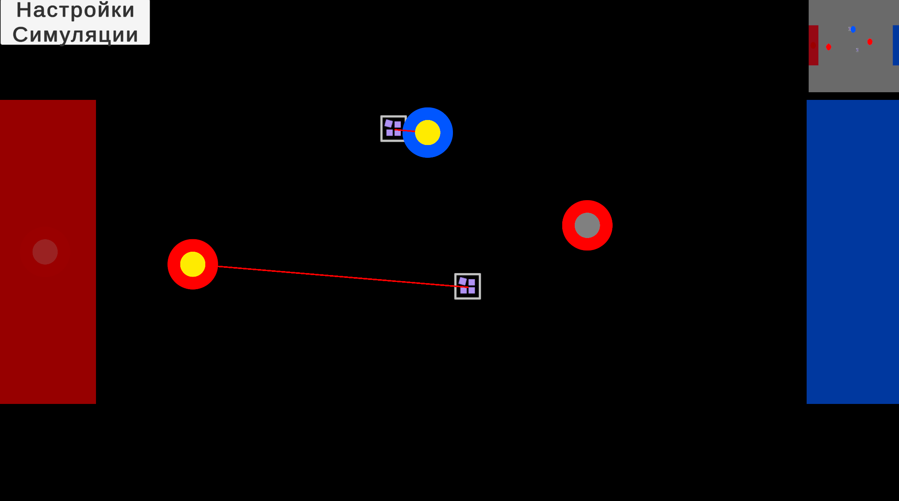
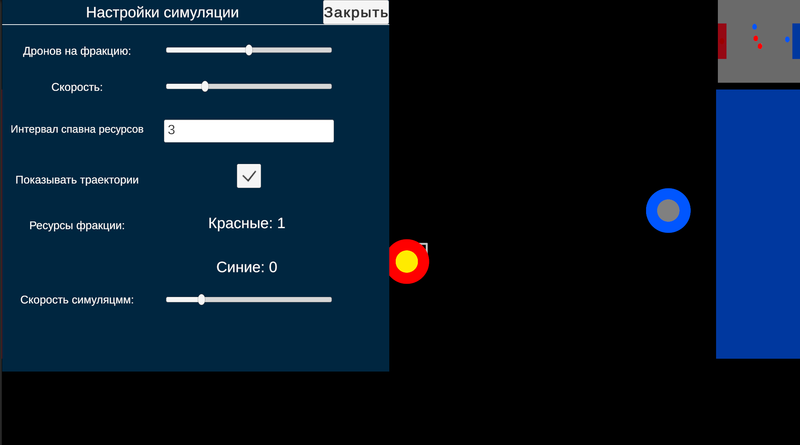

# Drone Resource Simulator

## Что реализовано

- Симуляция дронов двух фракций (красной и синей), собирающих ресурсы на карте.
- Дроны автоматически ищут ближайший свободный ресурс, летают к нему, собирают и возвращаются на базу.
- Избегание столкновений между дронами.
- Индикатор текущего состояния дрона цветом.
- Миникарта с отображением баз и дронов.
- Управление скоростью симуляции через UI.

## Архитектура

- **DroneManager** — отвечает за создание и управление дронами.
- **DroneController** — логика поведения каждого дрона (поиск ресурсов, сбор, возвращение).
- **ResourceNode** — объекты ресурсов на карте.
- **MiniMapRenderer** — отрисовка миникарты.
- Используется компонентный подход: дроны состоят из нескольких компонентов (контроллер, визуальный индикатор состояния и т.п.).

## Используемые инструменты и подходы

- Unity 2022 LTS (рекомендованная версия).
- C# 10.
- Коррутины для асинхронных операций (сбор и выгрузка ресурсов).
- Поиск и сортировка объектов по расстоянию.
- Компоненты Unity UI для управления скоростью симуляции.
- Игровая логика реализована с чистой архитектурой и разделением обязанностей.

## Скриншоты

## Запуск

- Открой проект в Unity 2022 или выше.
- Открой сцену `Main`.
- Нажми Play.

---

